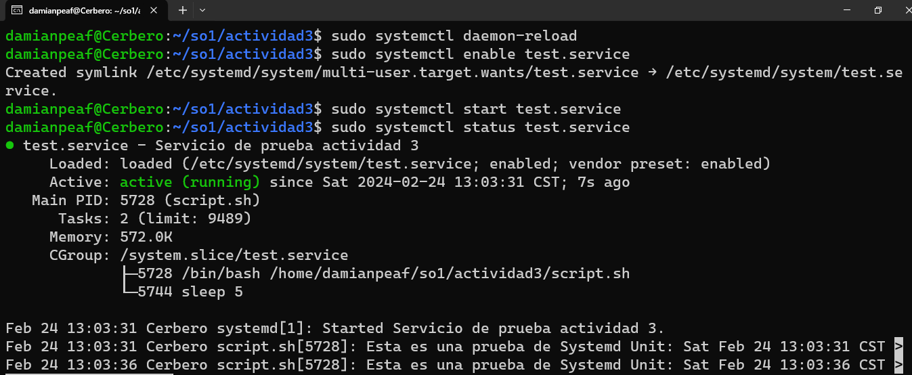
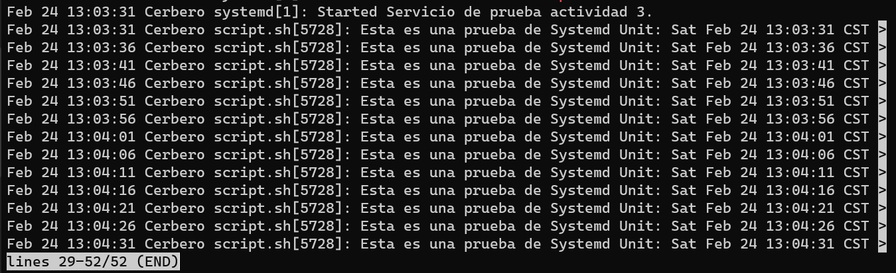
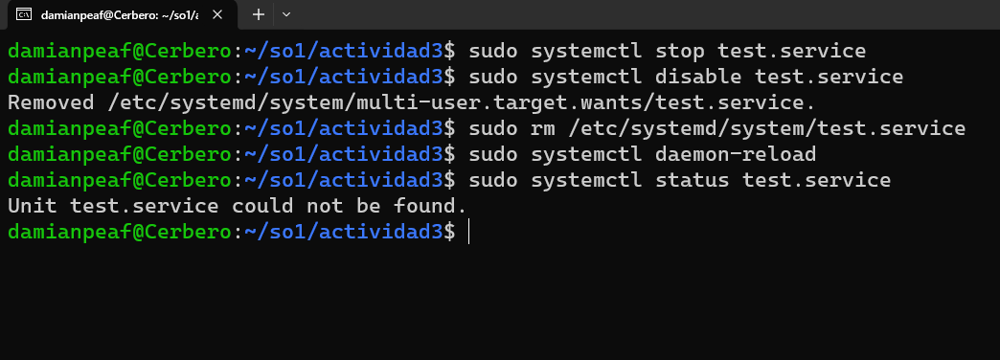

Actividad 3.

- Damián Ignacio Peña Afre
- 202110568

Crear un systemd unit de tipo servicio que realice lo siguiente.

- Ejecutar un script imprima un test y la fecha actual infinitamente con una pausa de un segundo.
- Habilitar el servicio para que se inicie con el sistema

<br>

1. Crear el archivo de bash `script.sh` que se ejecutará con el servicio.

```bash
#!/bin/bash

while true; do
    echo "Esta es una prueba de Systemd Unit: $(date)"
    sleep 1
done
```

2. Crear el archivo de systemd unit `test.service` y guardarlo en `/etc/systemd/system/`

```bash
[Unit]
Description=Servicio de prueba actividad 3

[Service]
Type=simple
ExecStart=/home/damianpeaf/so1/actividad3/script.sh # Ruta del script
Restart=always

[Install]
WantedBy=multi-user.target
```

3. Habilitar el servicio para que se inicie con el sistema

```bash
sudo systemctl daemon-reload
sudo systemctl enable test.service
sudo systemctl start test.service
sudo systemctl status test.service
```



4. Verificar que el servicio se esté ejecutando correctamente.

```bash
sudo journalctl -u test.service
```



5. Eliminar el servicio

```bash
sudo systemctl stop test.service
sudo systemctl disable test.service
sudo rm /etc/systemd/system/test.service
sudo systemctl daemon-reload
sudo systemctl status test.service
```


