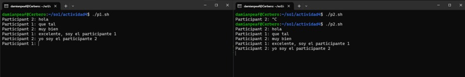

Actividad 4.

- Damián Ignacio Peña Afre
- 202110568

Crear un chat básico (únicamente dos participantes) utilizando Named Pipes y bash en Linux.

<br>

1. Crear el archivo de bash `p1.sh` que contendrá el código para el participante 1.

```bash
#!/bin/bash

# Definir las direcciones de los named pipes
PIPE_FROM_PARTICIPANT1="participant2_to_participant1"
PIPE_TO_PARTICIPANT1="participant1_to_participant2"

# Crear los named pipes si no existen
if [ ! -p "$PIPE_FROM_PARTICIPANT1" ]; then
    mkfifo "$PIPE_FROM_PARTICIPANT1"
fi

if [ ! -p "$PIPE_TO_PARTICIPANT1" ]; then
    mkfifo "$PIPE_TO_PARTICIPANT1"
fi

# Loop para recibir y enviar mensajes
while true; do
    # Recibir mensaje del participante 2
    read message < "$PIPE_FROM_PARTICIPANT1"
    echo "Participant 2: $message"

    # Solicitar mensaje y enviar al participante 2
    read -p "Participant 1: " message
    echo "Participant 1: $message" > "$PIPE_TO_PARTICIPANT1"
done
```

2. Crear el archivo de bash `p2.sh` que contendrá el código para el participante 2.

```bash
#!/bin/bash

# Definir las direcciones de los named pipes
PIPE_FROM_PARTICIPANT2="participant1_to_participant2"
PIPE_TO_PARTICIPANT2="participant2_to_participant1"

# Crear los named pipes si no existen
if [ ! -p "$PIPE_FROM_PARTICIPANT2" ]; then
    mkfifo "$PIPE_FROM_PARTICIPANT2"
fi

if [ ! -p "$PIPE_TO_PARTICIPANT2" ]; then
    mkfifo "$PIPE_TO_PARTICIPANT2"
fi

# Loop para recibir y enviar mensajes
while true; do
    # Solicitar mensaje y enviar al participante 1
    read -p "Participant 2: " message
    echo "$message" > "$PIPE_TO_PARTICIPANT2"

    # Recibir mensaje del participante 1
    read message < "$PIPE_FROM_PARTICIPANT2"
    echo "$message"
done
```

3. Ejecutar el archivo `p1.sh` en una terminal.
4. Ejecutar el archivo `p2.sh` en otra terminal.
5. Comenzar a chatear.


